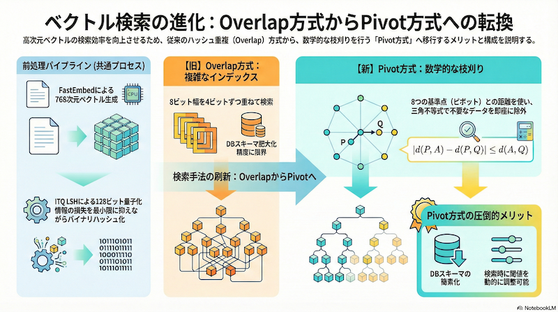

エンジニアリングにおいて、複雑なヒューリスティックを積み重ねた結果、管理しきれないほどの複雑さを抱え込んでしまうことがあります。
今回のプロジェクトでも、まさにその「泥沼」に足を踏み入れかけていました。

軽量なベクトル検索を実現するために採用していた「LSH（Locality Sensitive Hashing）」のOverlap戦略が限界を迎え、よりシンプルで数学的な裏付けのある「Pivot（参照点）ベース」の手法へと転換した話をします。31個のカラムを8個に削減し、劇的なスリム化と柔軟性を手に入れた過程の記録です。

<!-- more -->

## はじめに：なぜ軽量ベクトル検索なのか

HNSWなどのグラフベースのインデックスや、Qdrant, Pineconeといった専用ベクトルデータベースは非常に高性能です。しかし、これらはメモリコストが高かったり、新たなインフラ管理のコストが発生したりと、導入のハードルになることがあります。

私が目指しているのは、**既存のRDBMS（PostgreSQLなど）やNoSQL上で、追加のインフラコストなしに動作する「そこそこの精度」のベクトル検索**です。

これまでの検討（[2026-02-02の記事](../posts/2026-02-02-lsh-cascade-poc-intro.md)参照）では、`SimHash` ではなく、よりデータの分布に適応できる **ITQ (Iterative Quantization) LSH** を採用していました。ベクトルを128bitのバイナリコードに変換し、ハミング距離で検索するアプローチを試していました。

## 直面した壁：Overlap戦略の限界

最大の目的は、**データベースの検索範囲（探索候補）を劇的に減らすこと**です。そのためには、ITQ LSHで生成された128ビットのビット列の中から、「クエリに近い（ハミング距離が小さい）もの」だけを効率的に見つけ出す方法が必要でした。

しかし、通常のRDBMSのインデックスは「完全一致」や「範囲」には強いですが、「ビットが数個だけ違うもの」を探すのは苦手です。そこで、検索漏れ（取りこぼし）を防ぎつつ候補を見つけるために採用したのが「Overlap戦略」でした。これは、N-gramのようにビット列をずらしながら複数のインデックスを作成し、どれか一つでもヒットすれば候補とする手法です。

しかし、再現率（Recall）を実用的なレベルまで上げようとした結果、システムは肥大化してしまいました。

1.  **スキーマの爆発**: 取りこぼしを防ぐためにインデックスのパターンを増やした結果、インデックス用のカラム（または配列要素）が **31個** にも膨れ上がりました。この管理コストは無視できません。
2.  **柔軟性の欠如**: これらはインデックス作成時に固定されるため、「もう少し検索漏れを許容して高速化したい」や「厳密に絞り込みたい」といった調整をするには、インデックスの再構築が必要でした。

## 解決策：Pivot（参照点）ベース検索への転換

この複雑さを解消するために、「データ同士のハッシュ一致」を探すのをやめ、**「固定された参照点（ピボット）からの距離」**を利用する方針（Vantage Point Approach）へと、アーキテクチャを根本から見直しました。

### 原理：三角不等式の活用

仕組みはシンプルです。

1.  ベクトル空間内に、ランダムに **8つの「基準点（ピボット）」** を配置します。
2.  各データについて、これら8つのピボットからの距離（整数化）をあらかじめ計算し、保存しておきます。
3.  検索時は、**三角不等式** の性質を利用します。

三角不等式によれば、ある2点間の距離は、第3の点を経由した距離の差以上になります（$|d(A, P) - d(B, P)| \le d(A, B)$）。つまり、クエリとデータの間の距離の下限値を、ピボットとの距離の差だけで計算できるのです。

「東京から大阪までの距離」がわからなくても、「東京－名古屋間」と「大阪－名古屋間」の距離がわかれば、ある程度の予測やありえない値の除外ができるのと似ています。

## Pivot方式の圧倒的メリット

この転換によるメリットがありました。

### 1. データスキーマの劇的スリム化
複雑な31個の重複チャンク配列を保存する必要はなくなりました。代わりに必要なのは、シンプルな **8個の整数カラム** だけです。ストレージ容量も削減され、データベースへの負荷も下がりました。

### 2. 「スレッシュホールド」による動的な調整
これが最大の利点です。従来のOverlap方式ではインデックス作成時に感度が固定されていました。
しかしPivot方式であれば、検索時のクエリで「距離差」の閾値を変更するだけで挙動を変えられます。

```sql
-- 緩く検索したければ数値を大きく、絞りたければ小さくするだけ
WHERE ABS(metrics_0 - q_0) <= 20
  AND ABS(metrics_1 - q_1) <= 20
  ...
```

**実行時に**「精度重視」か「件数重視」かをコントロールできるこの柔軟性は、チューニングの工数を大幅に削減します。

## 実装イメージ（DuckDB）

実際の検索クエリも非常にシンプルになります。複雑なビット演算や配列展開は必要ありません。FastEmbedなどで生成したEmbeddingベクトルに対し、CPUだけで高速に候補を絞り込むことができます。

```sql
SELECT 
    id, 
    content
FROM 
    documents
WHERE 
    -- 8つのピボットについてのフィルター（論理積）
    ABS(p1_dist - $query_p1_dist) <= $threshold
    AND ABS(p2_dist - $query_p2_dist) <= $threshold
    AND ...
    AND ABS(p8_dist - $query_p8_dist) <= $threshold
```

この絞り込みを行った後、残った候補に対して、128ビット列のハミング距離を計算し更に絞り込みを行った後に、重い正確な距離計算（コサイン類似度など）を行えうことにしました。

## まとめと今後の展望

複雑なヒューリスティック（Overlap戦略）で31個のカラムを管理するよりも、シンプルな数学（三角不等式）に立ち返った方が、エンジニアリングとして正解でした。

「8カラムの整数インデックス」＋「動的スレッシュホールド」という構成は、シンプルながらも強力な「軽量ベクトル検索」の基盤となりました。何より、運用しながら精度とパフォーマンスのバランスを調整できる点が実用的です。

これをベースに実際のアプリケーションでの評価を進め、さらなる最適化や改良を加えていく予定です。


