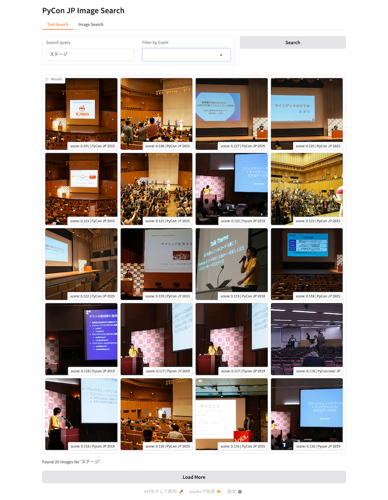

# Image Vector PoC: Gradioによるデモアプリの構築と実験結果

[Image Vector PoC](../../projects/image-vector-poc.md) プロジェクトの一環として、Gradioを使用したデモアプリを作成し、実際のデータを用いた検証を行っています。

## デモアプリの概要

今回作成したデモアプリでは、以下の主要な機能を実装しました。

- **テキスト検索機能**: 自然言語で画像を検索
- **類似画像検索機能**: アップロードした画像に似た画像を検索
- **フィルタリング機能**: イベントごとの絞り込み

モデルには、事前の実験で多言語対応において良好な結果を示した **Google SigLIP** を採用しています。

## 検証データ

検証には、**PyCon JP** がFlickrで公開している3万枚を超える写真データを使用しました。

## 実験結果

### できたこと
- **テキスト検索**: 「おやつ」や「ビール」といった日本語のキーワードを入力すると、多くの関連画像が高い精度でヒットすることを確認しました。
- **類似画像検索**: 画像を入力すると、構図や色合いなど「雰囲気」が似ている写真が検索結果として表示されました。

以下が、デモアプリのスクリーンショットです。

### できていないこと・課題
- **人物検索**: 特定の人の顔画像を入れても、まったくの別人が検索結果に出ることがあります。これは本システムが顔認識（Face Recognition）ではなく、画像全体のベクトル化を行っているためであり、想定される挙動ではありますが、利用時には注意が必要です。

## 考察

実際に触ってみて感じた点は以下の通りです。

- **大量のデータからの絞り込み**: さまざまなキーワードを使って検索すると、3万枚という膨大な写真の中からある程度絞り込まれた画像が瞬時に出てくるのは非常に便利だと感じました。
- **雰囲気や構図の一致**: 画像から画像を検索する場合、同じような構図や、服装を含めた「雰囲気」まで似た写真が出てくることが確認できました。
- **クロップ検索の有用性**: さらに、画像の一部をクロップしてその部分を指定して検索すると、同じようなカットの写真をピンポイントで取得できることがわかりました。これは素材探しなどで便利に使えそうです。

また、過去のイベント写真を眺めていると、個人的に懐かしい写真にも予期せず出会うことがあり、技術的な検証以上の感慨深さがありました。

## データの利用に関する注記
本検証で使用した写真データについて、以下の通り付記します。
- 使用した写真は [CC-BY PyCon JP](https://creativecommons.org/licenses/by/4.0/deed.ja) のライセンス下で公開されているものです。
- 筆者（寺田）は一般社団法人PyCon JP Associationの理事を務めておりますが、写真の取得にあたっては他の理事の許可を得た上でAPIキーを取得し、実施しました。
