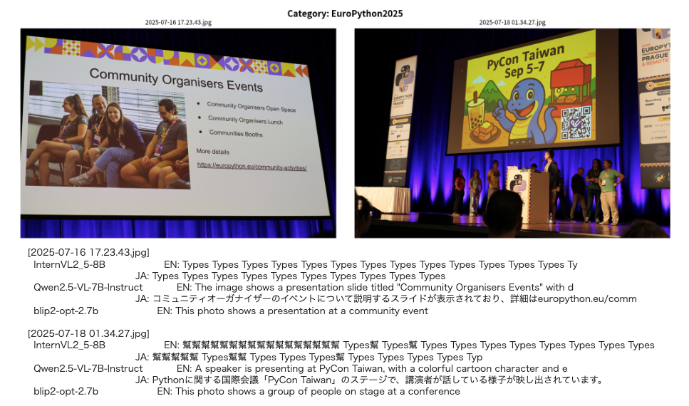

前回までの記事で、画像のベクトル検索の実験を進めてきましたが、今回は「画像からテキスト（キャプション）」を生成するモデルの実験を行いました。
画像の内容を言語化することで、検索のキーワードマッチングや、画像の内容説明（アクセシビリティ向上）などへの応用が期待できます。

実験の詳細な結果は以下のノートブックにまとめてあります。

[cmscom/image-vector-poc - 78-captioning-summary.ipynb](https://github.com/cmscom/image-vector-poc/blob/main/notebooks/78-captioning-summary.ipynb)

<!-- more -->

## 実験の目的

これまでは画像を直接ベクトル化して類似画像を検索していましたが、今回は **Vision Language Model (VLM)** を用いて、画像の内容をテキストとして説明（キャプション生成）させる実験を行いました。

生成されたテキストをベクトル化して検索に用いる「キャプションベースの検索」と、画像のベクトルを直接用いる「画像ベースの検索」の精度比較や、生成されるテキストの品質自体を確認することが目的です。

## 実験結果のハイライト

いくつかのモデルで実験を行いましたが、特に素晴らしい結果を残したのが **Qwen2.5-VL-7B-Instruct** です。

一方で、InternVL2.5-8B などの一部のモデルでは、期待通りのテキストが生成されず、同じフレーズを繰り返すなどの問題が発生しました（今回はこれらについては割愛します）。

### Qwen2.5-VL-7B-Instruct の実力

Qwen2.5-VL は、画像内の事物を認識するだけでなく、画像に含まれる文字（OCR）の認識能力も非常に高いことが確認できました。

特に印象的だったのが、ノートブック内の「結果8」にある以下の例です。

**対象画像**: `terada-202205-pyconjp-4-3-900.jpg`（PyCon JPのイベントでの写真）

この画像に対して、Qwen2.5-VL が生成した日本語キャプションは以下の通りです。

> **「赤いシャツを着た男性が、Python Conference Japanのロゴが入ったポロシャツを着用しています。」**

これは本当に驚くべき精度です。
単に「男性がいる」「赤いシャツを着ている」だけでなく、シャツにプリントされた **"Python Conference Japan"** という文字を正確に読み取り、それを自然な日本語の文章として統合しています。

英語のキャプションでも同様に正確な記述が生成されており、多言語対応と視覚認識・文字認識の統合レベルの高さが伺えます。

他にも、画像内の細かい要素を捉えたキャプションが生成されており、VLMの進化を強く感じる結果となりました。

以下の例は、Notebook内にありますが、EuroPython 2025でステージを撮影した写真のキャプションです。

- コミュニティオーガナイザーのイベントについて説明するスライドが表示されており、詳細は...
- Pythonに関する国際会議「PyCon Taiwan」のステージで、講演者が話している様子が映し出されています。

としっかりと内容を捉えています。

### 検索精度について

興味深い点として、検索精度（MRR: Mean Reciprocal Rank）の比較結果も出ています。

*   **Baseline (画像ベクトル直接)**: 0.79
*   **Qwen2.5-VL (生成キャプション経由)**: 0.47

現時点では、画像を直接ベクトル化する手法の方が、類似画像の検索精度自体は高いという結果になりました。生成されたテキストはどうしても情報が要約・捨象されるため、画像の微妙なニュアンス（画風や構図など）を完全には捉えきれない可能性があります。

しかし、Qwen2.5-VL のように具体的かつ固有名詞を含んだテキストを生成できる能力は、**「キーワードで画像を検索したい」** というニーズや、**「なぜこの画像が検索されたのか」** という説明性を高める上で、非常に強力な武器になると感じています。

## まとめ

今回の実験で、最新の VLM（特に Qwen2.5-VL）のキャプション生成能力が実用レベルに達しつつあることが実感できました。
特に日本語での詳細な記述生成能力は、今後のアプリケーション開発において大きな可能性を秘めています。
