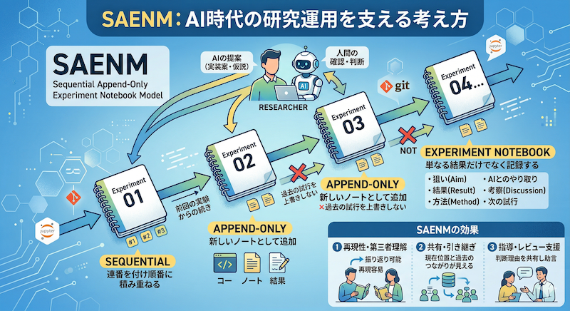

# AI時代の研究運用を支えるSAENMという考え方

これまで CMScomLab では、[ベクトル検索の実験](2026-02-03-vector-search.md) や [Graph RAG のPoC](2026-03-07-graph-rag-poc-start.md) のように、小さな実験や試作を積み重ねながら考えを前に進めてきました。その中で強く感じるようになったのは、最終的な成果だけでは残らない知見が多くあり、試行錯誤の過程そのものをどう記録し、共有し、振り返れる形にしておくかがますます重要になっているということです。

<!-- more -->

## SAENMとは何か

SAENM は **Sequential Append-Only Experiment Notebook Model** の略です。
実験ノートを時系列に沿って逐次追加し、過去の試行を上書きで消さず、判断の流れごと残していくための考え方です。

私はこれを、AI時代における再現可能な実験記録・共有・指導支援のための研究運用モデルとして捉えています。

## なぜこのようなモデルが必要なのか

JupyterLab や Git は、いまの実験やPoCにとって非常に便利な道具です。
コード、メモ、図表、履歴を一つの流れとして扱えるため、個人でもチームでも試行を進めやすくなりました。

ただ、それだけで再現性や第三者理解が自動的に担保されるわけではありません。
実験を進める途中では、途中の判断がノートの更新に埋もれたり、何を試して何をやめたのかが後から見えにくくなったりします。

とくに生成AIを使うようになると、仮説の候補や実装案が短時間で増え、試行回数そのものが一気に増えます。
その結果、どの判断を採用し、どこを人間が確認し、何を次に試そうとしたのかを残しておかないと、あとで自分でも追いにくくなります。

## SAENMの中核にある考え方

**Sequential** とは、実験を単発で終わらせず、連番を付けながら順番に積み重ねていくことです。
それによって、どの実験がどの検討の続きなのかが見えやすくなります。

**Append-Only** とは、過去の試行をきれいに上書きして消してしまうのではなく、新しい試行を新しいノートとして追加していくことです。
失敗や寄り道を含めて履歴を残すことで、判断の変化そのものが知見として扱えるようになります。

**Experiment Notebook** とは、単にコードや結果だけを残すものではありません。
その実験で何を狙ったのか、どういう結果になったのか、どう考えたのか、次に何を試すのかまで含めて、一つの実験単位として残していくことを意味します。

また、AIを使う場面では、AIへの問いかけ自体や、その提案のどこを採用し、どこを修正し、最終的に何を人間が確認したのかも記録対象に含めます。
重要なのはAIの出力をそのまま保存することではなく、AIをどう使って判断したかを追えるようにすることだと考えています。

## 研究・共有・指導にどう効くのか

この考え方のよいところは、最終結果だけでなく、そこに至るまでの比較対象や判断理由を残せることです。
そのため、あとから見返したときに再現しやすくなるだけでなく、なぜその方向に進んだのかも説明しやすくなります。

また、共同作業や引き継ぎの場面でも、現在位置と過去の試行がつながって見えるため、途中から入った人でも流れを追いやすくなります。
レビューや助言も、完成物への感想ではなく、どの実験に対して何を見て判断したかという形で残しやすくなります。

さらに、これは指導支援にも相性がよいと感じています。
研究者本人の振り返りに役立つのはもちろん、教員やメンターが「どこで詰まり、どの時点で方針が変わったのか」を把握しやすくなるため、助言の根拠を共有しやすくなります。

## おわりに

SAENM は、厳密な規格として先に定義したものというより、これまでの実験やPoCを積み重ねる中で見えてきた研究運用の考え方です。
実験の結果だけでなく、判断の連なりそのものを残していくことが、AI時代にはますます重要になると感じています。

今後も実践の中でこの考え方を少しずつ整理しながら、再現可能で共有しやすい研究の進め方として形にしていきたいと思います。
