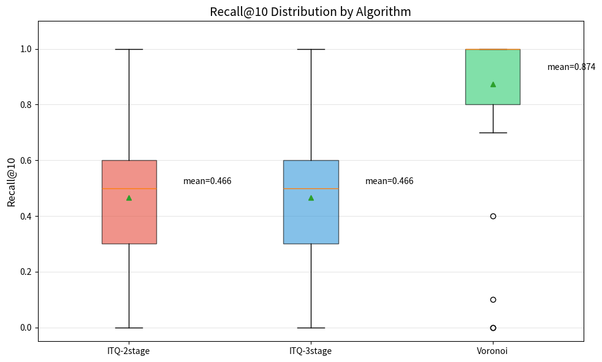

# Ploneサイト実データでベクトル検索の枝刈りアルゴリズムを比較した結果、Voronoi分割が有力だった

[2026-03-16の記事](2026-03-16-voronoi-text-embedding.md) で、テキスト embedding に対して Voronoi 分割による事前枝刈りが有効そうだという話を書きました。
今回はその続きとして、Plone サイトの実データで `collective.vectorsearch` の検索アルゴリズムを比較し、Voronoi 方式が実運用に近い条件でも有望であることを確認しました。

あわせて、[2026-02-14の記事](2026-02-14-plone-vector-search-released.md) で紹介した ITQ-LSH 系アルゴリズムについても、今回のデータ規模では精度面に課題があることが見えてきました。

<!-- more -->

## 実験の背景

Plone CMS に [collective.vectorsearch](https://github.com/collective/collective.vectorsearch/) を導入し、約 800 件の日本語コンテンツを対象に検索精度を比較しました。
対象には FAQ、ニュース、コラムなど、性質の異なる文書が混在しています。

今回の狙いは 2 つあります。

1. Voronoi 分割による事前枝刈りが、実データでも有効かを確認すること
2. 既存の ITQ-LSH ベース手法と比べて、どの程度の差が出るかを整理すること

## 比較対象のアルゴリズム

`collective.vectorsearch` では、現時点で以下の 4 方式を扱えます。

| アルゴリズム | 方式 |
| --- | --- |
| exhaustive_cosine | 全件に対するコサイン類似度計算 |
| itq_lsh_2stage | ITQ-LSH ハミング距離で候補を絞り込み、その後コサイン類似度でリランク |
| itq_lsh_3stage | ピボット枝刈りの後に ITQ-LSH を適用し、最後にコサイン類似度でリランク |
| voronoi_2stage | Voronoi 分割で候補を絞り込み、その後コサイン類似度でリランク |

`exhaustive_cosine` をベースラインとし、他の 3 方式がどこまでその結果を再現できるかを見ました。

## 実験設定

今回の設定は以下の通りです。

| 項目 | 値 |
| --- | --- |
| 埋め込みモデル | Multilingual E5 Base (FastEmbed) |
| チャンクサイズ | 500 |
| Pivot Threshold (Stage 1) | 200 |
| ITQ Candidates (Stage 2) | 100 |
| Voronoi Cell Assignments | 2 |
| Voronoi Cell Probes (Query) | 5 |

検索クエリは 58 種類を用意し、すべてのアルゴリズムで同一条件の検索を実行しました。
評価には `exhaustive_cosine` の結果を正解集合とみなし、Recall@10 を中心に比較しています。

クエリは専門用語、一般語、具体的な利用シナリオ、英語、表記ゆれなどを含め、偏りすぎないように構成しました。

## 結果

まず全体の精度は次の通りです。

| アルゴリズム | Recall@3 | Recall@5 | Recall@10 | Jaccard@10 |
| --- | --- | --- | --- | --- |
| voronoi_2stage | 0.862 | 0.872 | 0.874 | 0.826 |
| itq_lsh_2stage | 0.557 | 0.538 | 0.466 | 0.335 |
| itq_lsh_3stage | 0.557 | 0.538 | 0.466 | 0.335 |

Voronoi 分割は `exhaustive_cosine` の上位 10 件を約 87% 再現しました。
一方で ITQ-LSH 系は Recall@10 で約 47% に留まり、今回のデータセットでは差がかなり明確に出ました。

Recall@10 の分布を箱ひげ図で見ると、ITQ-LSH 系と Voronoi の差がより直感的に分かります。

この結果を見る限り、少なくとも 800 件規模の Plone サイトでは、Voronoi 分割の方が実用的な近似検索として成立しやすいと考えています。

## ITQ-LSH 2stage と 3stage が同じ結果になった

今回、`itq_lsh_2stage` と `itq_lsh_3stage` は全クエリで完全に同一の結果を返しました。
Jaccard は 1.000 で、追加したピボット枝刈りが実質的に機能していません。

理由としては、800 件規模では三角不等式による下界が緩く、候補削減が発生しなかった可能性が高いと見ています。
つまり 3-stage 化した効果が、この規模では出なかったということです。

この点は、ITQ-LSH が悪いというより、もう少し大きなデータセットで本領を発揮するタイプのアルゴリズムだと理解した方が自然です。

## クエリの傾向

クエリの種類ごとに見ると、いくつか傾向がありました。

- 専門的で具体的なクエリでは、Voronoi の Recall は 0.93 から 0.98 と高い
- 「コラム」「ニュース」のような意味の広い一般語では、Voronoi でもやや低下する
- 英語クエリは全アルゴリズムで低 Recall になりやすい

最後の点は、検索アルゴリズムそのものより、日本語主体のコンテンツに対する embedding 距離の問題だと見ています。
英語クエリや表記ゆれへの対応は、枝刈り方式の選択だけでは解決しません。

## 順位の並びは共通だった

興味深かったのは、共通して返されたアイテムの順位が全アルゴリズムで完全一致していたことです。
Spearman 相関は 1.000 でした。

これは最終段のリランキングがすべてコサイン類似度で行われているためで、候補集合さえ同じなら順位も一致します。
つまり今回の差は、後段の順位付けではなく、前段で何を候補として残せたかにあります。

## まとめ

今回の実験から、以下の点がはっきりしました。

- Voronoi 分割は、`exhaustive_cosine` の実用的な代替として機能する
- ITQ-LSH は 800 件規模では精度が不足しやすい
- この規模では全探索もまだ十分に現実的であり、レスポンス時間は検索より embedding 推論側に支配されやすい
- 英語クエリや表記ゆれの改善には、検索アルゴリズムではなく embedding モデル側の見直しが必要

[2026-03-16の記事](2026-03-16-voronoi-text-embedding.md) では Voronoi 分割の有効性を実験ベースで見ていましたが、今回の結果で Plone の実データに対しても一定の裏付けが取れました。
今後は、より大規模なデータセットで ITQ-LSH 系との再比較を続けつつ、`collective.vectorsearch` 側のデフォルト戦略も見直していくつもりです。
