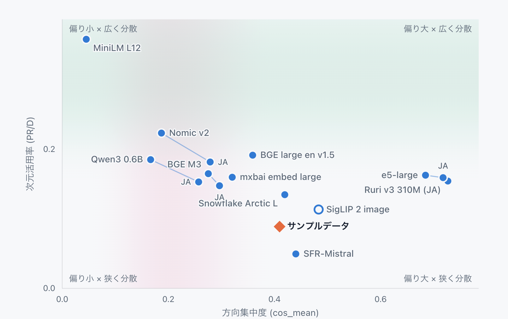

# ベクトルの特徴を知る「Vector Search Checkup」を公開しました

Embeddingモデルから生成したベクトルは、モデルやデータによって異なる特徴を持っています。その特徴を知らないままベクトルDBや検索方法を選び、量子化を進めてよいのでしょうか。

今回、手元のベクトルをブラウザー上で診断できる[Vector Search Checkup](https://vectorcheckup.cmscom.jp/)をβ公開しました。Embedding空間の分布や幾何学的な特徴を数値と図で確認し、次に何を検証するかを考えるためのツールです。

ここでいう「診断」は、ベクトルの良し悪しを判定するものではありません。まず特徴を知り、その結果を手がかりに、用途や制約に合った検索を一緒に作り、改善していくための出発点です。

<!-- more -->

## 同じ次元数でも、ベクトルの特徴は同じではない

ベクトル検索では、文章や画像をEmbeddingモデルで数値の並びに変換します。同じ次元数のベクトルであっても、モデルや入力データが変われば、空間内での広がり方や特定方向への偏り方は同じではありません。

Vector Search Checkupでは、主に次のような特徴を確認できます。

- ベクトル全体が共通の方向へどの程度偏っているか
- 空間の次元をどの程度広く使っているか
- ベクトルの長さがどのように分布しているか
- 分散が少数の主成分へどの程度集中しているか

画面では、方向集中度（cos_mean）、次元活用率（PR/D）、ノルム、PCA寄与率などの指標を表示します。参照用に計測した複数のEmbeddingモデルとの位置関係も確認できます。

図の横軸は方向集中度、縦軸は次元活用率です。診断したベクトルが、参照モデルの中でどのあたりに位置するかを視覚的に確認できます。

これらは検索品質そのものを表す点数ではありません。例えば、方向の偏りが強いからといって、そのベクトルが直ちに使えないわけではありません。用途やデータによっては、その特徴を持ったまま良い検索結果を得られる場合もあります。

## 診断結果は合否ではなく、次の問いを作るために使う

[前回の記事](2026-08-18-vector-similarity-and-search-quality.md)では、ベクトル空間での近さと、利用者にとっての検索結果の良さを分けて評価する必要があると紹介しました。Vector Search Checkupが扱うのは、そのうちベクトル空間の特徴を知るための手がかりです。

診断結果だけで「このEmbeddingモデルを採用する」「このベクトルDBなら正解」と決めるものではありません。結果を見ながら、次のような問いを具体的にしていきます。

- 別のEmbeddingモデルでも同じデータを比較するべきか
- 文書側とクエリ側のベクトルに、どのような違いがあるか
- 全件検索とANNで、必要な検索結果をどれだけ維持できるか
- 量子化の前後で、分布や実際の検索結果がどう変わるか
- データ量、速度、メモリ、費用の制約に合う保存・検索方法は何か

ベクトルの分布特性は、ベクトルDBやインデックス方式を比較するときの条件整理に役立つと考えています。量子化についても、必要なメモリを減らせるかだけでなく、元のベクトルが持つ特徴や検索結果をどこまで保てるかを確かめる必要があります。

診断は答えを一つ返すものではなく、比較実験の条件と優先順位を決めるために使います。

## 手元のファイルをブラウザー内で診断できる

無料ローカル診断では、CSV、JSONL、NumPy、Parquet形式のベクトルファイルを読み込めます。解析はブラウザー内で行われ、ベクトル、ファイル名、行データはサーバーへ送信されません。診断に使えるデータがない場合は、特徴の異なるサンプルデータで結果の見方を試せます。

また、二つのベクトル群を読み込み、同じモデルの異なる条件、モデル変更の前後、クエリ側と文書側などを比較することもできます。

無料診断で表示する指標は、公開文献のある標準的な手法に基づいて計算しています。一方、画面に示すレベルや参照値は、私たちが複数のモデルとデータで計測した結果に基づく比較の目安です。普遍的な合否基準ではなく、検索品質に対して較正された値でもありません。

## 診断から改善までを一緒に進める

Vector Search Checkupで特徴が見えたら、実際の検索クエリ、検索対象、期待する結果を使って仮説を確かめます。

1. 手元のベクトルの特徴を診断する
2. モデル、DB、ANN、量子化など、比較する条件を決める
3. 同じ評価用データで検索品質、速度、メモリ、費用を測る
4. 結果を記録し、次に変える条件を決める

この流れを繰り返すことで、「何となく精度が悪い」「どのDBを選べばよいか分からない」という状態から、比較できる問いへ変えていけます。

無料ローカル診断だけでは、利用者にとっての検索結果の良さまでは分かりません。必要に応じて、検索クエリ、候補データ、正解例を使った品質評価や、個別の条件に合わせた分析へつなげます。診断結果について相談したい場合は、Checkupの画面から結果を添えてお問い合わせいただけます。

## PyCon JP 2026の先も育てていく

Vector Search Checkupは、8月21日（金）の[PyCon JP 2026で紹介する画像検索システム](https://2026.pycon.jp/ja/talks/BUZXVG)に向けた準備から生まれました。2.3万枚を超える写真を検索する仕組みを作る中で、検索結果だけでなく、その土台にあるベクトルの特徴を共通の言葉で確認できる道具が必要になりました。

ただし、カンファレンスのためだけのツールで終わらせるつもりはありません。今後も診断できる内容や結果の伝え方を見直し、実際のデータで得られた知見を改善へつなげられるよう育てていきます。

ベクトルをまだ取り出せない場合や、何から確認すればよいか分からない場合は、今回あわせて公開した[ベクトル検索の相談窓口](https://vector.cmscom.jp/)をご利用ください。RAG、セマンティック検索、画像検索などについて、目的やデータが固まっていない段階から相談できます。

まずは[Vector Search Checkup](https://vectorcheckup.cmscom.jp/)で、手元のベクトルがどのような特徴を持っているか確かめてみてください。その特徴を出発点に、用途と制約に合った検索を一緒に考えていきます。
